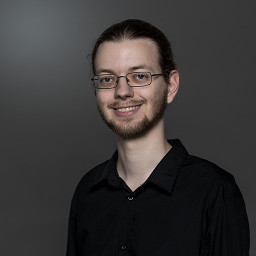

:Title: About me
:Date: 2019-07-28 11:41
:Author: surt91
:FeaturedImage: img/portrait.jpg
:Status: published
:Lang: de

Ich bin Hendrik Schawe und Doktorand in der Arbeitsgruppe
`Computerorientierte Theoretische Physik <https://www.uni-oldenburg.de/compphys/>`_
der Universität Oldenburg.

Momentan erforsche ich large deviation Eigenschaften der
konvexen Hüllen von random Walks. Weitere Interessengebiete
sind Phasenübergänge, Optimierungsprobleme und Netzwerke.
