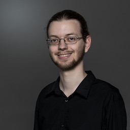

.. Portfolio documentation master file, created by
   sphinx-quickstart on Tue Jan 19 20:34:57 2016.

.. _index-label:

=====
Index
=====

My name is Hendrik Schawe and I am a PhD student
in the `Computational Physics <https://www.uni-oldenburg.de/compphys/>`_
group of the University Oldenburg.

Currently, I am working on large deviation properties
of convex hulls of random walks.
Further research Interests are phase transitions,
optimization problems and networks.

.. include:: contact.inc

.. include:: publications.inc

.. include:: cv.inc

.. toctree::
    :hidden:
    :maxdepth: 0

    index
    projects
